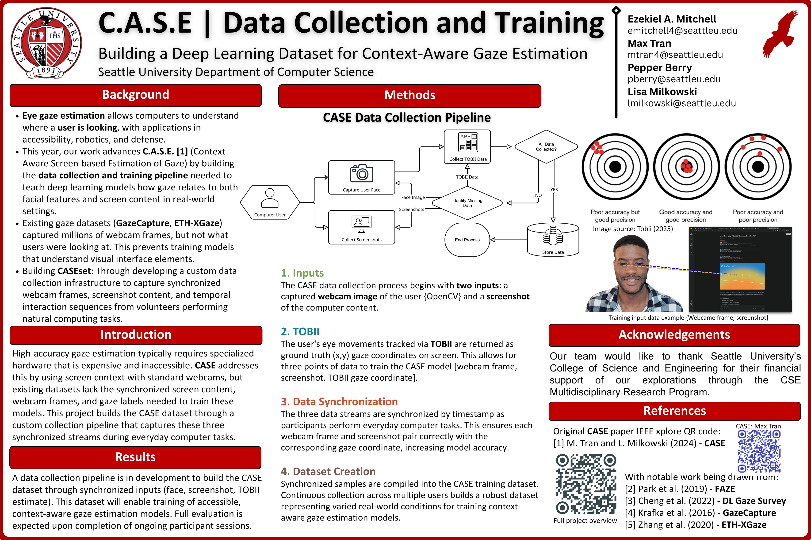

# CASEset

<figure><figcaption><p>S.U. Fall 2025 Undergraduate Research Showcase - CASEset<br>github: <a href="https://github.com/ezekielamitchell/CASEset">https://github.com/ezekielamitchell/CASEset</a></p></figcaption></figure>

## Overview

**CASEset** is the dataset and training infrastructure for **CASE (Context-Aware Screen-based Estimation of Gaze)** - a computer vision approach that bridges the accuracy gap between expensive specialized eye-tracking hardware and accessible webcam-based gaze estimation.

### The Problem

High-accuracy gaze tracking (0.47°-1.5° error) currently requires expensive specialized hardware like Tobii eye trackers or Meta's Project Aria glasses. Accessible webcam-based approaches lag significantly at >3° accuracy - a gap that limits practical applications in human-computer interaction, accessibility, and attention analysis.

### The Key Insight

Existing large-scale gaze datasets (GazeCapture, ETH-XGaze) capture millions of webcam frames but **not what users were looking at on screen**. This prevents training models that understand visual interface elements - contextual information that humans naturally use when inferring where someone is looking.

CASEset addresses this by capturing synchronized screen content alongside gaze data, enabling context-aware models that can leverage visual saliency, UI element positions, and interaction patterns.

## Technical Architecture

### CASEset Dataset Pipeline

The dataset collection infrastructure synchronizes three data streams:

| Stream | Source | Purpose |
|--------|--------|---------|
| **Webcam Frames** | Standard webcam | Face/eye appearance for gaze estimation |
| **Desktop Screenshots** | Screen capture | Visual context of what user is viewing |
| **Ground Truth Gaze** | Tobii Pro Fusion | High-precision gaze coordinates for supervision |

**Key Requirements:**
- Sub-50ms synchronization across all three modalities
- Temporal interaction sequences during natural computing tasks
- Diverse interface contexts (web browsing, documents, applications)

### FAZE-CCT Hybrid Model

The proposed model architecture combines appearance-based gaze estimation with screen context refinement:

```
┌─────────────────────────────────────────────────────────────────────┐
│                        FAZE-CCT Pipeline                            │
├─────────────────────────────────────────────────────────────────────┤
│                                                                     │
│  Webcam Frame ──► FAZE DT-ED ──► Normalized Gaze Vector             │
│                        │                                            │
│                        ▼                                            │
│              Coordinate Translator ──► Tentative Screen Coords      │
│              (5-layer FC network)              │                    │
│                                                ▼                    │
│  Screenshot ──► Extract 400×400 patch ──► CCT (Compact Conv.        │
│                 centered on tentative      Transformer)             │
│                                                │                    │
│  Historical Clicks (up to 3) ─────────────────►│                    │
│                                                ▼                    │
│                                    Final Refined (x, y) Coords      │
│                                                                     │
└─────────────────────────────────────────────────────────────────────┘
```

**Stage 1: FAZE DT-ED**
- Processes webcam frames to extract normalized gaze vectors
- Based on the Few-Shot Adaptive Gaze Estimation architecture [19]

**Stage 2: Coordinate Translation**
- 5-layer fully-connected network
- Maps gaze vectors to tentative screen coordinates

**Stage 3: CCT Refinement**
- Compact Convolutional Transformer processes 400×400 screenshot patches
- Patch centered on tentative prediction from Stage 2
- Incorporates temporal context via up to 3 historical click positions
- Outputs final refined screen coordinates

## Knowledge Distillation Approach

CASEset enables a knowledge distillation paradigm where expensive, high-precision hardware (Tobii Pro Fusion) teaches cheaper, more accessible hardware (standard webcams) to achieve better accuracy. This approach supports deployment scenarios where:

- Equipment cost and accessibility are critical constraints
- Privacy-preserving on-device processing is essential
- Real-time performance is required without cloud dependencies

## Roadmap

Target milestones for solo research development through Fall 2026 graduation.

### Winter 2026 (Current Quarter: Jan - Mar)

**Focus: Infrastructure & Pilot Data**

- [ ] Set up synchronized capture pipeline (webcam + screen + Tobii)
- [ ] Implement timestamp alignment system (<50ms sync)
- [ ] Develop data validation and quality checks
- [ ] Collect pilot dataset (~5-10 sessions) to validate pipeline
- [ ] Reproduce FAZE DT-ED baseline on existing datasets (ETH-XGaze)

**Deliverable:** Working data collection system with validated pilot data

### Spring 2026 (Apr - Jun)

**Focus: Full Data Collection & Initial Model**

- [ ] Recruit participants and collect full CASEset dataset (~50+ sessions)
- [ ] Implement coordinate translator network (Stage 2)
- [ ] Implement CCT refinement module (Stage 3)
- [ ] Initial end-to-end training on pilot data
- [ ] Begin hyperparameter tuning and architecture iteration

**Deliverable:** Complete dataset + functional FAZE-CCT prototype

### Summer 2026 (Jun - Aug)

**Focus: Model Refinement & Optimization**

- [ ] Full model training on complete CASEset
- [ ] Hyperparameter tuning and architecture iteration
- [ ] Ablation studies (context contribution, temporal history, patch sizes)
- [ ] Cross-user generalization evaluation

**Deliverable:** Optimized FAZE-CCT model with ablation results

### Fall 2026 (Sep - Dec)

**Focus: Evaluation & Thesis Completion**

- [ ] Benchmark against baselines (FAZE-only, GazeCapture-trained models)
- [ ] Final model evaluation and analysis
- [ ] Write and defend thesis
- [ ] Prepare publication-ready results

**Deliverable:** Defended thesis + submission-ready paper

### Risk Mitigation

| Risk | Mitigation |
|------|------------|
| Tobii access limited | Prioritize collection sessions; explore synthetic augmentation |
| Participant recruitment slow | Start recruiting early; leverage lab connections |
| Model underperforms | Have ablation checkpoints; simpler fusion fallback |
| Time constraints | Core pipeline first; advanced features (temporal context) as stretch goals |

## Related Work

This project builds on the foundational CASE paper:

> M. Tran and L. Milkowski (2024) "CASE: Context Aware Screen-Based Estimation of Gaze," Eighth IEEE International Conference on Robotic Computing (IRC), Tokyo, Japan, 2024, pp. 112-113. [IEEE Xplore](https://ieeexplore.ieee.org/document/10818040)

See [References](references.md) for a complete bibliography of related work in gaze estimation, vision transformers, and multimodal learning.

## Project Structure

```
CASEset/
├── README.md              # This file
├── SUMMARY.md             # GitBook table of contents
├── references.md          # Bibliography and citations
└── docs/
    └── README.md          # Additional documentation
```

## Citation

If you use CASEset in your research, please cite:

```bibtex
@inproceedings{tran2024case,
  title={CASE: Context Aware Screen-Based Estimation of Gaze},
  author={Tran, M. and Milkowski, L.},
  booktitle={Eighth IEEE International Conference on Robotic Computing (IRC)},
  pages={112--113},
  year={2024},
  organization={IEEE}
}
```

## License

[License information to be added]

## Acknowledgments

S.U. Fall 2025 Undergraduate Research Showcase
